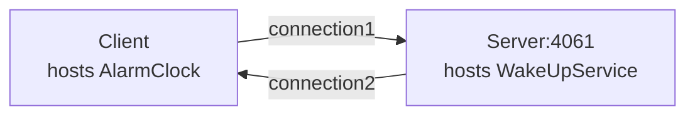

# Ice Callback

The Callback demo illustrates how to implement callbacks in a client application.

In this demo, the client hosts an alarm clock (an Ice object) and asks the server's wake-up service to call this
object at a later time. The server opens a TCP connection to the client when making this call.



We recommend running each program in a separate Python virtual environment.  
If you are new to Python virtual environments, see [Python Virtual Environments].

## Running the server

Navigate to the `server` directory.

### 1. Create and activate a Python virtual environment

#### macOS and Linux

```bash
python3 -m venv venv
source venv/bin/activate
```

#### Windows (PowerShell)

```powershell
python -m venv venv
venv\Scripts\activate
```

### 2. Install program dependencies

```bash
pip install -r requirements.txt
```

### 3. Compile the Slice definitions

Use the Slice-to-Python compiler to generate Python code from the `AlarmClock.ice` file:

```bash
slice2py ../slice/AlarmClock.ice
```

### 4. Run the server

```bash
python main.py
```

## Running the client

In a separate terminal, navigate to the `client` directory.

### 1. Create and activate a Python virtual environment

#### macOS and Linux

```bash
python3 -m venv venv
source venv/bin/activate
```

#### Windows (PowerShell)

```powershell
python -m venv venv
venv\Scripts\activate
```

### 2. Install program dependencies

```bash
pip install -r requirements.txt
```

### 3. Compile the Slice definitions

Use the Slice-to-Python compiler to generate Python code from the `AlarmClock.ice` file:

```bash
slice2py ../slice/AlarmClock.ice
```

### 4. Run the client

```bash
python main.py
```

[Python Virtual Environments]: https://docs.python.org/3/tutorial/venv.html
