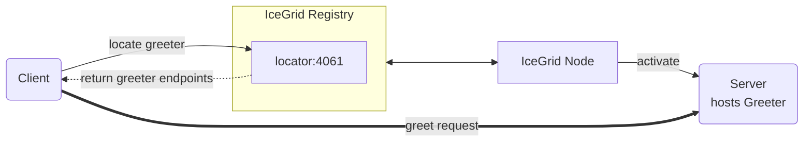

# IceGrid Greeter

The IceGrid Greeter demo illustrates how to create a very simple IceGrid deployment that manages a Greeter server.



## Prerequisites

- [uv] Python package and project manager.
- Install IceGrid. See [Ice service installation].

## Running the server with IceGrid

### 1. Compile the Slice definitions

Navigate to the `server` directory and use the Slice-to-Python compiler to generate Python code from the `Greeter.ice`
file:

```bash
uv run slice2py ../slice/Greeter.ice
```

### 2. Start the IceGrid registry

In a separate terminal, run:

```bash
icegridregistry --Ice.Config=config.registry
```

### 3. Start the IceGrid node

In another terminal, first activate the virtual environment, then start the node:

#### macOS and Linux

```bash
source server/.venv/bin/activate
icegridnode --Ice.Config=config.node
```

#### Windows (PowerShell)

```powershell
server\.venv\Scripts\activate
icegridnode --Ice.Config=config.node
```

> [!NOTE]
> We need to start `icegridnode` from an active Python virtual environment in order for it to find the server program
> dependencies installed in that environment.

### 4. Deploy the Greeter application

Use the IceGrid admin tool to deploy the configuration:

```bash
icegridadmin --Ice.Config=config.admin -e "application add greeter-hall.xml"
```

`greeter-hall.xml` configures a single Greeter server.
As an alternative, you can deploy 3 replicated Greeter servers with:

```bash
icegridadmin --Ice.Config=config.admin -e "application add greeter-hall-with-replication.xml"
```

## Running the client

In a separate terminal, navigate to the `client` directory.

### 1. Compile the Slice definitions

Use the Slice-to-Python compiler to generate Python code from the `Greeter.ice` file:

```bash
uv run slice2py ../slice/Greeter.ice
```

### 2. Run the client

```bash
uv run main.py
```

[uv]: https://docs.astral.sh/uv/
[Ice service installation]: https://github.com/zeroc-ice/ice/blob/main/NIGHTLY.md#ice-services
