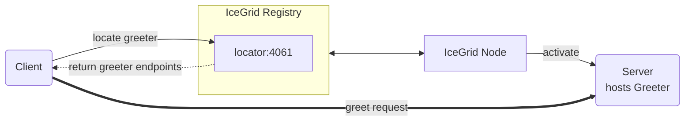

# IceGrid Greeter

The IceGrid Greeter demo illustrates how to create a very simple IceGrid deployment that manages a Greeter server.



We recommend running each program in a separate Python virtual environment.  
If you are new to Python virtual environments, see [Python Virtual Environments].

## Running the server with IceGrid

### 1. Create and activate a Python virtual environment

Navigate to the `server` directory and set up a virtual environment:

#### macOS and Linux

```bash
python3 -m venv venv
source venv/bin/activate
```

#### Windows (PowerShell)

```powershell
python -m venv venv
venv\Scripts\activate
```

### 2. Install program dependencies

```bash
pip install -r requirements.txt
```

### 3. Compile the Slice definitions

Use the Slice-to-Python compiler to generate Python code from the `Greeter.ice` file:

```bash
slice2py ../slice/Greeter.ice
```

### 4. Start the IceGrid registry

In a separate terminal, run:

```bash
icegridregistry --Ice.Config=config.registry
```

### 5. Start the IceGrid node

In another terminal, first activate the virtual environment, then start the node:

#### macOS and Linux

```bash
source server/venv/bin/activate
icegridnode --Ice.Config=config.node
```

#### Windows (PowerShell)

```powershell
server\venv\Scripts\activate
icegridnode --Ice.Config=config.node
```

> [!NOTE]  
> We need to start `icegridnode` from an active Python virtual environment in order for it to find the server program
dependencies installed in that environment.

### 6. Deploy the Greeter application

Use the IceGrid admin tool to deploy the configuration:

```bash
icegridadmin --Ice.Config=config.admin -e "application add greeter-hall.xml"
```

`greeter-hall.xml` configures a single Greeter server.  
As an alternative, you can deploy 3 replicated Greeter servers with:

```bash
icegridadmin --Ice.Config=config.admin -e "application add greeter-hall-with-replication.xml"
```

## Running the client

### 1. Create and activate a Python virtual environment

Navigate to the `client` directory and set up a virtual environment:

#### macOS and Linux

```bash
python3 -m venv venv
source venv/bin/activate
```

#### Windows (PowerShell)

```powershell
python -m venv venv
venv\Scripts\activate
```

### 2. Install program dependencies

```bash
pip install -r requirements.txt
```

### 3. Compile the Slice definitions

Use the Slice-to-Python compiler to generate Python code from the `Greeter.ice` file:

```bash
slice2py ../slice/Greeter.ice
```

### 4. Run the client

```bash
python main.py
```

[Python Virtual Environments]: https://docs.python.org/3/tutorial/venv.html
