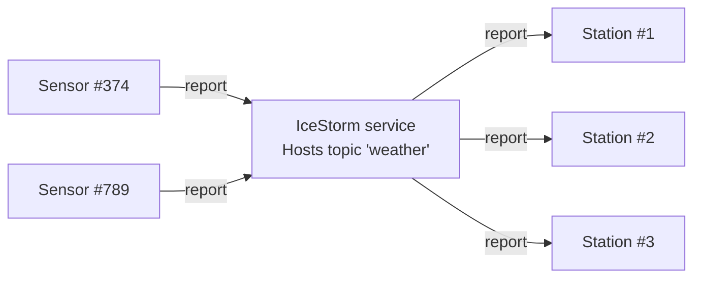

# IceStorm Weather

This demo shows how to use IceStorm to create a simple pub-sub application. In this demo, one or more weather sensors
report the local temperature and humidity to one or more weather stations via IceStorm. The sensors are the publishers
while the weather stations are the subscribers.



## Prerequisites

- Install uv. See [Installing uv].
- Install IceStorm. See [IceStorm installation].

## Start IceStorm service

Run the IceStorm service in its own terminal:

```shell
icebox --IceBox.Service.IceStorm="IceStormService,38:createIceStorm --Ice.Config=icestorm.conf"
```

## Running the sensor

Navigate to the `sensor` directory, to run the sensor program.

### 1. Compile the Slice definitions

Use the Slice-to-Python compiler to generate Python code from the `WeatherStation.ice` file:

```shell
uv run slice2py ../slice/WeatherStation.ice
```

### 2. Run the sensor

```shell
uv run main.py
```

> [!NOTE]
> You can run multiple sensor programs, each in its own terminal.

## Running the station

In a separate terminal, navigate to the `station` directory to run the station program.

### 1. Compile the Slice definitions

Use the Slice-to-Python compiler to generate Python code from the `WeatherStation.ice` file:

```shell
uv run slice2py ../slice/WeatherStation.ice
```

### 2. Run the station

```shell
uv run main.py
```

> [!NOTE]
> You can run multiple station programs, each in its own terminal.

[Installing uv]: https://docs.astral.sh/uv/getting-started/installation/
[IceStorm installation]: https://zeroc.com/ice/downloads/3.8/icestorm
