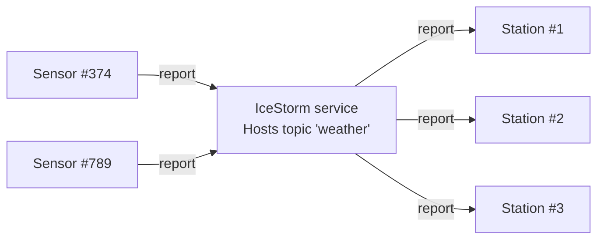

# IceStorm Weather

This demo shows how to use IceStorm to create a simple pub-sub application. In this demo, one or more weather sensors
report the local temperature and humidity to one or more weather stations via IceStorm. The sensors are the publishers
while the weather stations are the subscribers.



We recommend running each program in a separate Python virtual environment. If you are new to Python virtual
environments, see [Python Virtual Environments].

## Start IceStorm service

Run the IceStorm service in its own terminal:

```shell
icebox --IceBox.Service.IceStorm="IceStormService,38a0:createIceStorm --Ice.Config=config.icestorm"
```

## Running the sensor

Navigate to the `sensor` directory, to run the sensor program.

- Create and activate a Python virtual environment:

    ```shell
    python -m venv venv
    source venv/bin/activate  # On macOS/Linux
    venv\Scripts\activate     # On Windows
    ```

- Install the program dependencies:

    ```shell
    pip install -r requirements.txt
    ```

- Compile the WeatherStation.ice file with the Slice compiler for Python:

    ```shell
    slice2py ../slice/WeatherStation.ice
    ```

- Run the sensor program:

    ```shell
    python main.py
    ```

>[!NOTE]
> You can run multiple sensor programs each in its own terminal.

## Running the station

In a separate terminal, navigate to the `station` directory to run the station program.

- Create and activate a Python virtual environment:

    ```shell
    python -m venv venv
    source venv/bin/activate  # On macOS/Linux
    venv\Scripts\activate     # On Windows
    ```

- Install the program dependencies:

    ```shell
    pip install -r requirements.txt
    ```

- Compile the WeatherStation.ice file with the Slice compiler for Python:

    ```shell
    slice2py ../slice/WeatherStation.ice
    ```

- Run the station program:

    ```shell
    python main.py
    ```

>[!NOTE]
> You can run multiple station programs each in its own terminal.

[Python Virtual Environments]: https://docs.python.org/3/tutorial/venv.html
