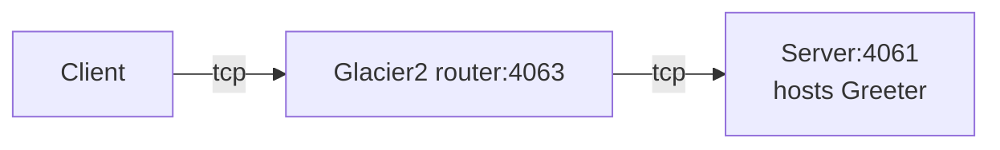

# Glacier2 Greeter

This demo shows how to write a client that calls an Ice object hosted in a server "behind" a Glacier 2 router:



## Ice prerequisites

- Install the Ruby dev kit. See [Ice for Ruby installation].

## Building and running the demo

Ice for Ruby supports only client-side applications. As a result, you first need to start the Glacier2 router and a
Greeter server implemented in a language with server-side support, such as Python, Java, or C#.

Then, in a separate window:

- Compile Greeter.ice with the Slice to Ruby compiler into Greeter.rb

```shell
slice2rb Greeter.ice
```

- Run the client application

```shell
ruby client.rb
```

[Ice for Ruby installation]: https://github.com/zeroc-ice/ice/blob/main/NIGHTLY.md#ice-for-ruby