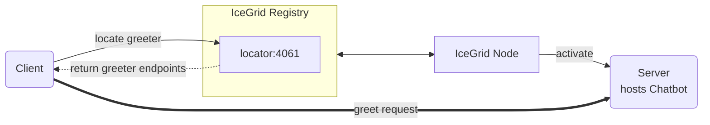

# IceGrid Greeter

The IceGrid Greeter demo illustrates how to call an Ice server managed by IceGrid from a client written in Ruby.



## Ice prerequisites

- Install the Ruby dev kit. See [Ice for Ruby installation].

## Building and running the demo

Ice for Ruby supports only client-side applications. As a result, you first need to deploy the IceGrid Greeter
server implemented in a language with server-side support, such as Python, Java, or C#.

Then, in a separate window:

- Compile Greeter.ice with the Slice to Ruby compiler into Greeter.rb

```shell
slice2rb Greeter.ice
```

- Run the client application

```shell
ruby client.rb
```

[Ice for Ruby installation]: https://zeroc.com/ice/downloads/3.8/ruby
