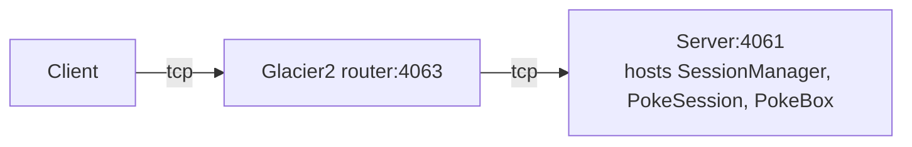

# Glacier2 Session

This demo shows how to implement and configure a Session Manager with Glacier2. A Session Manager creates
application-level session objects that typically maintain some per-session state.

This demo also illustrates how to use a default servant that implements multiple objects (see the SharedPokeBox class).

In the demo, the client catches Pokémon and stores them in a PokeBox hosted by the server behind the Glacier2 router:



In a typical Glacier2 deployment, the client can establish a connection to the Glacier2 router but cannot establish
a connection to the server, because the server is on a separate network.

## Ice prerequisites

- Install Glacier2. See [Ice service installation].

## Building and running the demo

1. Build the demo:

   ```shell
   swift build
   ```

2. Start the server in its own terminal:

   ```shell
   swift run Server
   ```

3. Start the Glacier2 router in its own terminal:

   ```shell
   glacier2router --Ice.Config=config.glacier2
   ```

   > [!TIP]
   > You can also start the Glacier2 router before the server. The order does not matter.

4. Finally, run the client application several times:

    ```shell
    swift run Client ash
    swift run Client ash
    swift run Client ash
    ```

    If you don't specify a name, the client uses the current username.

[Ice service installation]: https://github.com/zeroc-ice/ice/blob/main/NIGHTLY.md#ice-services
