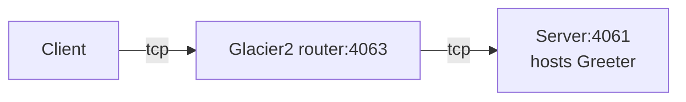

# Glacier2 Greeter

This demo shows how to write a client that calls an Ice object hosted in a server "behind" a Glacier2 router:



In a typical Glacier2 deployment, the client can establish a connection to the Glacier2 router but cannot establish
a connection to the server, because the server is on a separate network.

Follow these steps to build and run the demo:

1. Build the client and server applications:

   ```shell
   swift build
   ```

2. Start the Server program in its own terminal:

   ```shell
   swift run Server
   ```

3. Start the Glacier2 router in its own terminal:

   ```shell
   glacier2router --Ice.Config=config.glacier2
   ```

   > [!TIP]
   > You can also start the Glacier2 router before the server. The order does not matter: the server is identical to the
   > server provided in the [Ice Greeter][1] demo and does not depend on Glacier2.

4. Run the client application:

   ```shell
   swift run Client
   ```

[1]: ../../Ice/greeter
