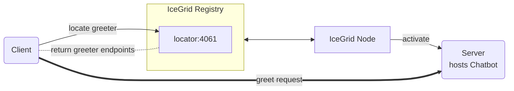

# IceGrid Greeter

The IceGrid Greeter demo illustrates how to create a very simple IceGrid deployment that manages a Greeter server.



Follow these steps to build and run the demo:

1. Build the client and server applications:

   ```shell
   swift build
   ```

2. Start the IceGrid registry in its own terminal:

   ```shell
   icegridregistry --Ice.Config=config.registry
   ```

3. Start the IceGrid node in its own terminal:

   First, add the server build directory to the PATH environment variable:

   ```shell
   export PATH=$PWD/.build/debug:$PATH
   ```

   Then, start the IceGrid node:

   ```shell
   icegridnode --Ice.Config=config.node
   ```

4. Deploy the "GreeterHall" application in this IceGrid deployment:

   ```shell
   icegridadmin --Ice.Config=config.admin -e "application add greeter-hall.xml"
   ```

   `greeter-hall.xml` configures a single Greeter server. As an alternative, you can deploy 3 replicated Greeter servers
   with:

   ```shell
   icegridadmin --Ice.Config=config.admin -e "application add greeter-hall-with-replication.xml"
   ```

   > [!TIP]
   > Use `update` instead of `add` to update an existing application.

5. Run the client application:

   ```shell
   swift run Client
   ```

## Platform Support

This demo is only available for macOS because the ice-swift dependency is only available for macOS. It does not build on Linux.
